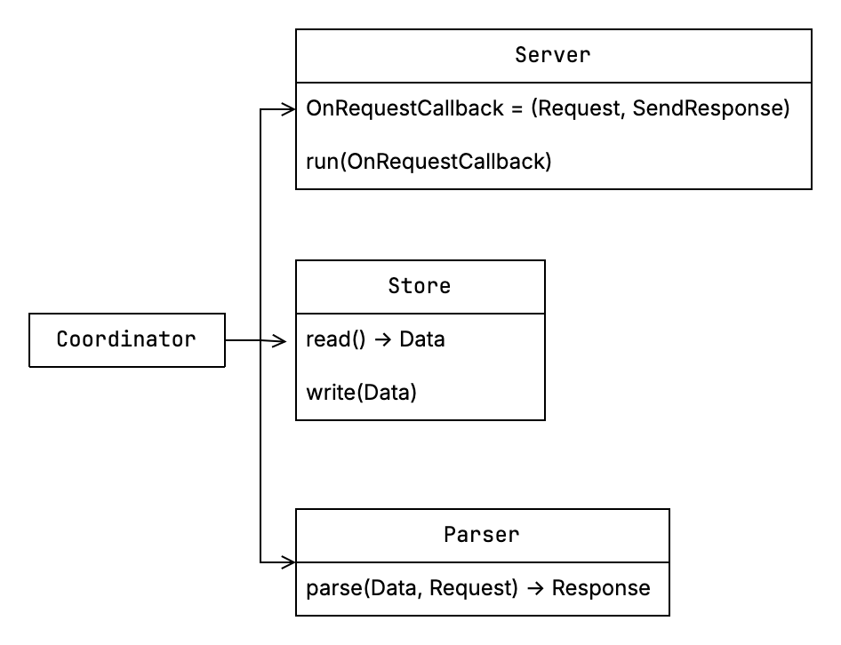

#  Mocktail 🥤  


> Built with pain, joy, and Swift.  


Mocktail was a personal exploration of REST API request parsing and validation logic in Swift — including full support for GET, POST, PUT, PATCH, DELETE against a JSON snapshot.

## Why I built it

> Learn, experiment, prototype and have fun

*[Typycode's json-server ](https://github.com/typicode/json-server)* is excellent, but it lacks built-in JWT authentication. I wanted to explore what it would look like to create a similar tool with:

- JWT authentication
- CSV as a writable, human-friendly data source
- Binary generation for portable mock servers

The goal was to enable a workflow where a prototype app could include a bundled, ready-to-run server — all tracked in a single repo.

## 🚧 Status: Archived

The project it's currently paused, in favor of exploring simpler and more pragmatic approaches (like Express + JWT proxying for `json-server`).  

Basically I realized that wrapping `json-server` behind a simple **JWT-authenticated Express proxy** solves 90% of what I was building here in about **12 lines of JavaScript**.

But the lessons, pain, and caffeine-fueled commitment that went into this stay here. I learnt a ton and I had a lot of fun.

## Use case and desired api

### CSV data source

Given a `/db/*.csv` data source as follow:

```
/db
  ├ recipes.csv
``` 

### Serve

```shell
~ mocktail ./db
Server started on PORT: 4000
Endpoins 
http://localhost:4000/recipes

~ curl localhost:8080/recipes
[
  {
    "id": "1",
    "title": "Fried chicken"
  }
]
```

### Generate binary

```shell
~ mocktail -g ./db -o recipesMockServer
```

#### Binary Usage

```
~ ./recipesMockServer start
Server started on PORT: 4000
Endpoins 
http://localhost:4000/recipes
```

### JWT Auth mode

```shell
~ mocktail -a ./db
Server started on PORT: 4000
Endpoins 
http://localhost:4000/login
http://localhost:4000/register
http://localhost:4000/recipes

$ curl localhost:4000/recipes
{"error":"Unauthorized"}
```


### System design



#### Implementation idea

```swift
protocol Server {
	typealias SendResponse = (Response) -> Void
	func run(port: Int, onRequest: (Request, SendResponse) -> Void)
}

protocol Parser {
	func parse(_ data: Data, request: Request) -> Response
}

protocol Store {
	func read() -> Data
	func write(_ data: Data)
}

struct Controller {
	let server: Server
	let parser: Parser
	let store : Store
	
	func start() {
		server.run(port: 4000) { request, sendResponse in
			let snapshot = store.read()
			let response = parser.parse(snapshot, request: request)
			response.is2XX ? store.write(response.data) : ()
			sendResponse(response)
		}
	}
}
```


## ✅ Implemented

At the moment, only the parser component was implemented:

-	GET, POST, PUT, PATCH, DELETE
-	Header and content-type validation
-	Resource and route resolution

## ❌ Missing features from *json-server*

- Parameter filters
- Nested routing parsing
- Missing *server and store* components from designed system.

## 📚 Lessons Learned

- Writing a parser for REST requests from scratch teaches you a ton about HTTP.
- TDD is your best friend for sanity when writing infrastructure.t